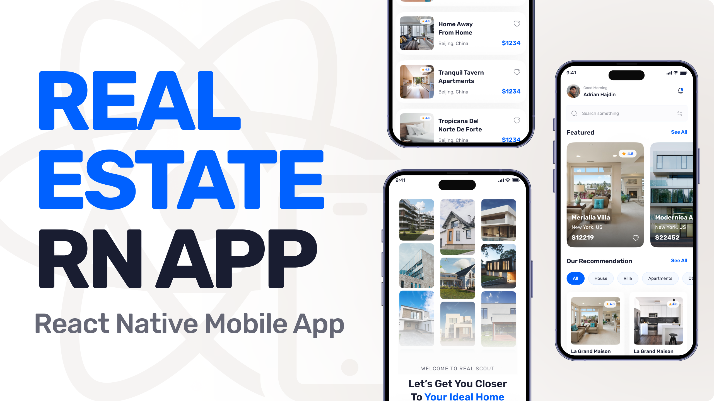

# ReState

<div align="center">



</div>

<p align="center">
  
  
  
</p>

## 📋 <a name="table">Table of Contents</a>

1. 👋 [Welcome](#welcome)
2. ⚙️ [Tech Stack](#tech-stack)
3. 🔋 [Features](#features)
4. 🔄 [Alternate Version](#alternate-version)
5. 🤸 [Quick Start](#quick-start)
6. 🚀 [More](#more)

## <a name="welcome"> 👋 Welcome </a>

Thanks for checking out this flutter mobile app. This was originally suppose to be built
with [React Native](https://reactnative.dev/) from one of JavaScript Mastery Youtube
channel [JavaScript Mastery](https://www.youtube.com/watch?v=kmy_YNhl0mw&t=13465s) (Shout out to
Adrian 😃 ), but I decided to build the mobile app using [Flutter](https://flutter.dev/). Please
check it out 😮 and let me know what you think.

## <a name="tech-stack">⚙️ Tech Stack </a>

- Flutter 3.4.0
- Dart 3.4.0
- Provider 6.1.2
- flutter supabase
- flutter dotenv 

## <a name="features">🔋 Features</a>

👉 **Google OAuth Authentication**: allowing users to securely sign in and manage their accounts using
their google accounts

👉 **Carousel of All available properties**: carousel to view all properties

👉 **search and filter functionality**: search property by name or filter by different categories of properties

## <a name="alternate-version"> 🔄 Alternate Version </a>

-  By changing the branch of this repo to 'feature/fetchData' , you can see this app with full backend implementation with supabase. That means it has
  - 👉 **Authentication**
  - 👉 **Data fetching from Database**
  

## <a name="quick-start"> 🤸 Quick Start </a>

Follow this steps to setup the project locally on your machine.

**Prerequsites**

Make sure you have the following installed on your machine

- [Git](https://git-scm.com/)
- [Dart](https://dart.dev/get-dart)
- [Flutter](https://docs.flutter.dev/get-started/)

**Cloning the Repository**

```bash
git clone https://github.com/Miki0035/flutter_real_state_app.git

cd flutter_real_state_app
```

**Check everything**

Check if everything is setup to run a flutter application:

```bash
flutter doctor
```

**Installation**

Install the project dependencies using flutter:

```bash
 flutter pub get
```

**Running the Project**

Install an android emulator or use your android device in debug mode

```bash
flutter run
```

## <a name="more"> 🚀 More </a>

- For supabase to work you need an account and create .env with values
  - SUPABASE_URL=[YOUR_URL]
  - SUPABASE_ANON_KEY=[YOUR_ANON_KEY]

